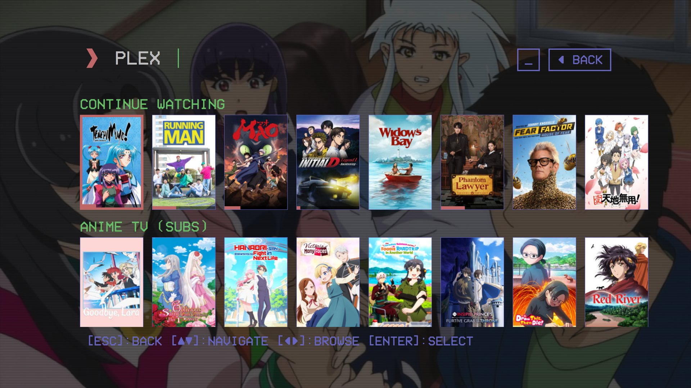
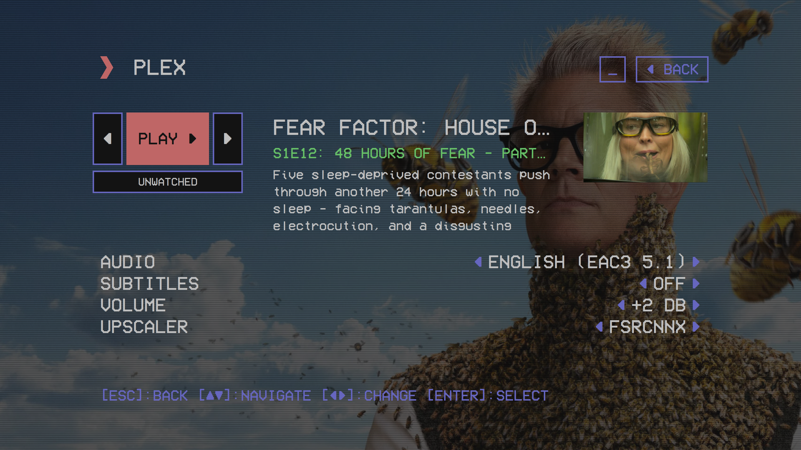
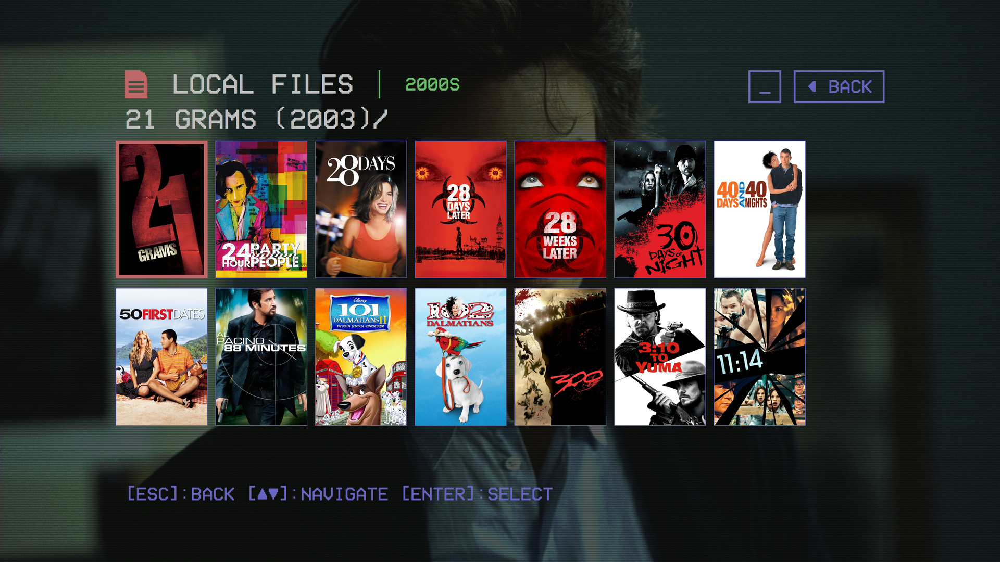
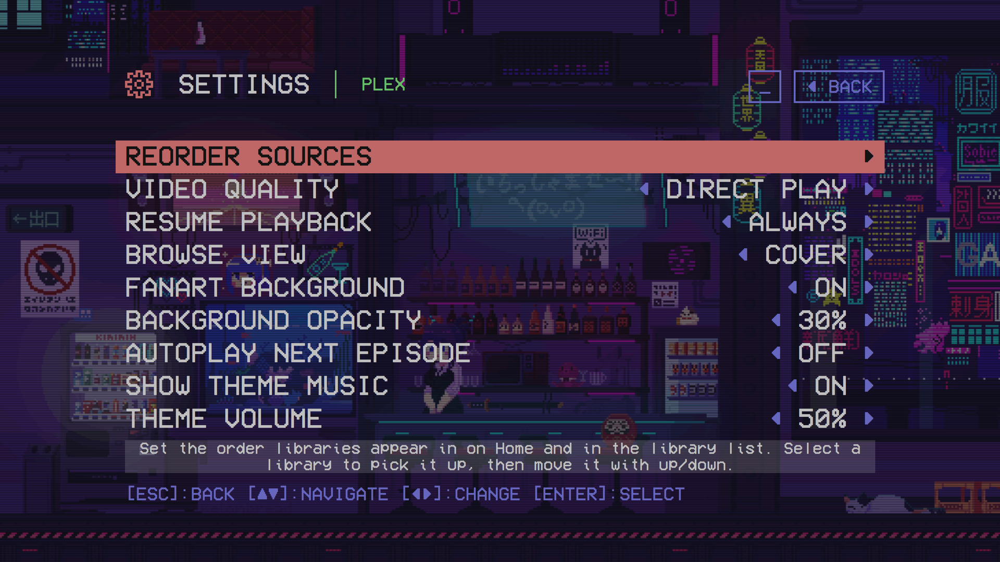
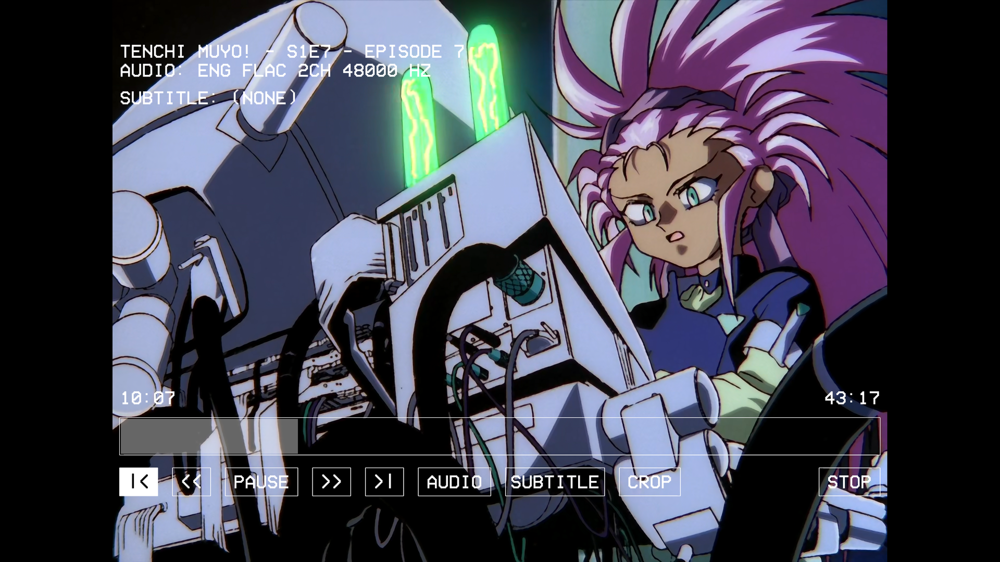

# 240-MP for Windows

240-MP is a retro VCR style frontend to play content on a TV-connected PC. **This repository is the Windows port** of [anthonycaccese/240-MP](https://github.com/anthonycaccese/240-MP), which targets Raspberry Pi (preferably hooked up to a CRT TV) and macOS. The core experience carries over — the VCR-style UI, the modules, the mpv hand-off — rebuilt on Windows-native plumbing and extended with the features below.

Playback experiences are handled via modules to enable new integrations without requiring major changes to the overall frontend. There are 5 included playback modules; [Local Files](https://github.com/anthonycaccese/240-MP/wiki/Module:-Local-Files), [Plex](https://github.com/anthonycaccese/240-MP/wiki/Module:-Plex), [Jellyfin](https://github.com/anthonycaccese/240-MP/wiki/Module:-Jellyfin), [YouTube](https://github.com/anthonycaccese/240-MP/wiki/Module:-YouTube) and a module similar to art/wallpaper modes on modern tvs called [Ambient:Mode](https://github.com/anthonycaccese/240-MP/wiki/Module:-Ambient-Mode).

It works in conjunction with [mpv](https://mpv.io/), which the [install script](#install) sets up as a dependency.

## Screenshots

|  |  |
|--|--|
| <br>**Plex Home** — Continue Watching (with watch‑progress bars) alongside your own hub rows, over hover fanart with the show's theme music playing. | <br>**Info screen** — PREV / PLAY / NEXT, plus per‑title **Audio, Subtitles, Volume and Upscaler** that carry across a whole show. |
| <br>**Local Files** — a Cover browse view rendered from Kodi / TinyMediaManager poster artwork. | <br>**Settings** — reorder sources, Cover view, fanart backgrounds, theme music, autoplay and more. |
| <br>**Playback** — mpv fullscreen with a VCR‑style on‑screen control bar (seek, audio, subtitle, crop). |  |

## Added in this port

On top of the platform rewrite, this port adds a number of features — all optional, all under **Settings**. (The module system and design are unchanged; see [ARCHITECTURE.md](ARCHITECTURE.md).)

**Plex**
- **Watchlist** — a bookmark on the info screen adds or removes a movie/show from your Plex‑account watchlist; a **Watchlist** menu (in place of the Continue Watching shortcut) browses the titles you've saved that are on your server, as a poster grid or a name list.
- **Episodes browser** — an EPISODES button on a show opens a season‑by‑season screenshot view, and the info screen's PREV/NEXT step across whole seasons.
- **Skip Intro** — from the server's intro markers, auto‑skip the intro or show a Skip button (Off / Auto / Button).
- **Home dashboard** — Continue Watching and per‑library Recently Added rows over hover fanart with theme music; **Watch‑progress bars** on in‑progress posters. Browse View picks a poster dashboard or a two‑pane text layout.
- **Cast & Extras** — play trailers/featurettes inline, or open an actor's filmography.
- **Cover or Title browse** — poster grids or name lists, episode thumbnails, and optional scanlined fanart backgrounds across the browse/show/season/info screens.

**Local Files**
- **Artwork & metadata** — reads Kodi/TinyMediaManager posters/fanart (`poster.jpg`, `fanart.jpg`, `<name>-poster.jpg`…) and `.nfo` cast; optional Cover view and fanart backgrounds like Plex, plus a Continue Watching row that tracks partially‑watched videos.
- **Watched tracking** — a ✓ on played files and on folders whose every video is watched; a folder holding a single video opens its info directly.
- **Series handling** — a show/movie folder shows its videos flattened unless it has `Season N` subfolders (then those are seasons); bonus videos appear under Cast & Extras.

**Plex & Local Files**
- **Per‑title playback settings** — audio language, subtitle language, volume gain (± dB) and video upscaler, chosen on the info screen and carried across a show's episodes.
- **Video upscalers** — GPU‑accelerated mpv GLSL shaders (**ArtCNN, FSRCNNX, Anime4K**, plus a High‑Quality preset) — handy for bringing SD anime up to a 4K panel.
- **“Up next”** — finishing an episode (or backing out during the credits) lands on the *next* episode's info.
- **Seamless theme music** — a show's theme starts on hover while browsing and carries, uninterrupted, into its info screen.
- **Info‑screen actions** — Watched/Unwatched and Remove‑from‑Continue‑Watching buttons under Play.

**Everywhere**
- **Single composed window** — the mpv video window is married to the app: one taskbar button, one Alt‑Tab entry, and the menu returns cleanly on top when playback ends.
- **Controller & touchscreen parity** — anything the keyboard does, a gamepad does (bumpers page the lists); touch taps to highlight then select, drags/flicks to scroll, with floating BACK/minimize chips, and tap‑to‑reveal player controls during playback. Footer hints adapt to the last device used.
- During playback, Enter shows the on‑screen controls (Space still pauses), and holding Enter or long‑pressing Subtitle turns subtitles off.

## Under the hood (Windows)

Only the platform layer was rebuilt — not translated line‑by‑line:

- **mpv control** over a Windows named pipe (`\\.\pipe\240mp-mpv`); **hardware decode** via D3D11VA (`--hwdec=auto-safe`, override with the `mpv_video_args` setting). mpv can be bundled by dropping `mpv.exe` into `<app folder>\mpv\`, which 240-MP prefers over any system install.
- **Gamepads** via SDL2 — XInput and DirectInput pads (Xbox, PlayStation, 8BitDo, NES‑style clones) with hotplug.
- **Install** is one PowerShell script (no admin) that also brings in mpv/yt‑dlp via winget/scoop/choco, with optional autostart‑at‑logon. **Self‑update** from Settings → Update swaps the per‑user install (`%LOCALAPPDATA%\Programs\240-MP`) with a detached helper.
- **Directory browser** navigates above `C:\` to switch drives. **Logs** land in `%APPDATA%\240-MP\logs\240mp.log` (`MP240_CONSOLE=1` also mirrors them to a launching terminal). The display is kept awake while the app runs.

Everything Raspberry‑Pi‑specific (KMS/DRM hand‑off, per‑Pi decode profiles, systemd autostart) doesn't apply here and was removed rather than ported.

## Current Features

> **Note:** **Jellyfin and YouTube remain untested in this port so far** — Plex and Local Files are the focus. They're ported but unverified, so don't hesitate to [report any bugs](https://github.com/john-videojockey/240-MP-Win/issues)!

### Local Files Module ([Wiki](https://github.com/anthonycaccese/240-MP/wiki/Module:-Local-Files))
- Supported file types: `"mp4", "mkv", "avi", "mov", "m4v", "webm", "wmv", "flv", "f4v", "mpg", "mpeg", "vob"`
- Playlist support using `m3u` and `m3u8` files
- Folder browsing
- Loop playback
- Shuffle playback
- Playback history
- Switch audio/subtitle tracks during playback

### Plex Module ([Wiki](https://github.com/anthonycaccese/240-MP/wiki/Module:-Plex))
- Designed for simple, fast, list browsing
- Supported library types: `Movies, TV Shows, Other Videos`
- Server switching
- User profile switching and auto sign in
- Select specific libraries to display
- Continue Watching and Resume
- Autoplay next episode in a season (optional, off by default)
- Hub, Playlist, Collection and Category support
- Movie editions
- Select preferred audio/subtitle track before playback and switch tracks during playback
- Full library browsing by letter
- Show/Season browsing
- Video quality selection: Direct Playback (Default) or Transcode options

### Jellyfin Module ([Wiki](https://github.com/anthonycaccese/240-MP/wiki/Module:-Jellyfin))
- Designed for simple, fast, list browsing
- Supported library types: `movies, tvshows, homevideos, boxsets`
- "Quick Connect" authentication
- Select specific libraries to display
- Continue Watching, Next Up and Resume Playback
- Autoplay next episode in a season (optional, off by default)
- Collections support
- Select preferred audio/subtitle track before playback and switch tracks during playback
- Full library browsing by letter
- Show/Season browsing
- Video quality selection: Direct Playback (Default) or Transcode options

### YouTube Module ([Wiki](https://github.com/anthonycaccese/240-MP/wiki/Module:-YouTube))
- Designed for simple, fast, list browsing
- Built to list content from YouTube RSS feeds and playback via mpv + yt-dlp (no auth required)
- View Subscriptions: Browse the latest videos from your configured channels as a reverse chronological list
- Browse by Channel: Browse videos by Channel
- Save to Watch Later: Save videos to watch later. This is local to 240-MP (on device only), not associated to any account and the list can be cleared in settings at any time.
- View Watch History: Displays a list of recently watch videos via the module. This is local to 240-MP (on device only), not associated to any account and the list can be cleared in settings at any time.
- Resume Playback: Resume from your last playback position or restart from the beginning
- Set Playback Resolution: 480p, 720p and 1080p
- Choose to Display Shorts or not (default is On)

### Ambient:Mode Module ([Wiki](https://github.com/anthonycaccese/240-MP/wiki/Module:-Ambient-Mode))
- Supported video file types: `"mp4", "mkv", "avi", "mov", "m4v", "webm", "wmv", "flv", "f4v", "mpg", "mpeg", "vob"`
- Playlist support for audio tracks using `m3u` and `m3u8` files
- Mix video with a different audio track
- Loops forever until you stop it

### Global
- [Color Schemes](https://github.com/anthonycaccese/240-MP/wiki/Customizations)
- [Keyboard & Controller](https://github.com/anthonycaccese/240-MP/wiki/Input) input support, plus touchscreen/mouse navigation
- Media Keys during video playback (volume +/-, mute, play/pause, stop, seek, next chapter, previous chapter)
- In-app self-update from GitHub Releases

## Install

One-liner (PowerShell — no admin needed):

```powershell
irm https://github.com/john-videojockey/240-MP-Win/releases/latest/download/install.ps1 | iex
```

Full options (autostart, custom folder, uninstall) and the manual zip install are in **[INSTALL.md](INSTALL.md)**. Building from source is covered in **[BUILDING.md](BUILDING.md)**.

## Credits & Acknowledgments

- This is a Windows port of [240-MP](https://github.com/anthonycaccese/240-MP) by Anthony Caccese — many of the app's design, modules, and views are his work.
- The `VCR OSD Mono` font was created by Riciery Santos Leal (a.k.a. mrmanet) https://www.dafont.com/vcr-osd-mono.font
- Like upstream, this port was built with substantial help from [Claude Code](https://www.anthropic.com/product/claude-code).
- Thank you to Plex for providing an open and free [API](https://developer.plex.tv/), and to [the mpv team](https://mpv.io/) for a simple, extensible and cross platform media player.

## License

This project is licensed under the GNU General Public License v3.0. See [LICENSE](LICENSE) for the full text.

You are free to use, study, and modify this code. If you distribute a modified version, you must also distribute it under GPL-3.0 and make the source available.
